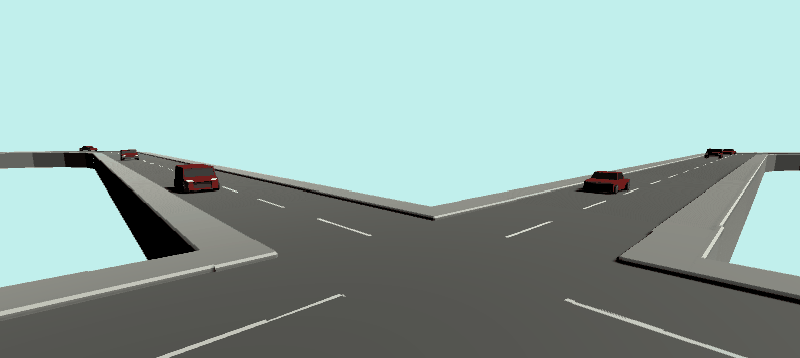
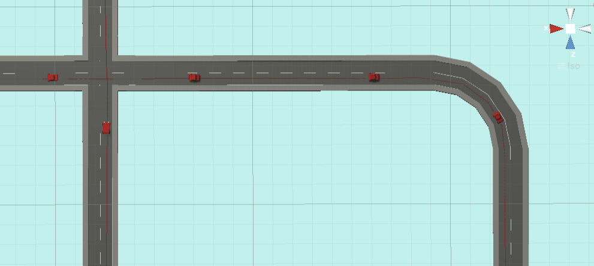
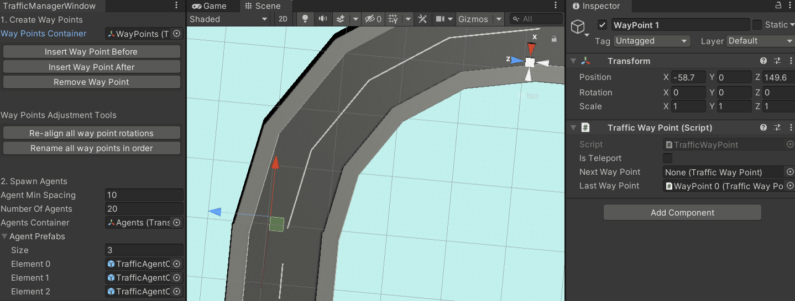

# Simple traffic system for Unity

Simple way points traffic system that allows easy creation of way points, generating traffic agents, and basic traffic agent behavior.

## Motivation
This is useful for simple background traffic that follows specified paths on a loop, and may need to respond to special vehicles or other obstacles.

## Install instructions
1. `git clone` or download this repo to the Asset folder

## Credits
References video by [GameDevGuide](https://www.youtube.com/watch?v=MXCZ-n5VyJc)

## License
[MIT](https://opensource.org/licenses/MIT)

* Feel free to use to start your own projects!
* Feedback very much appreciated :)